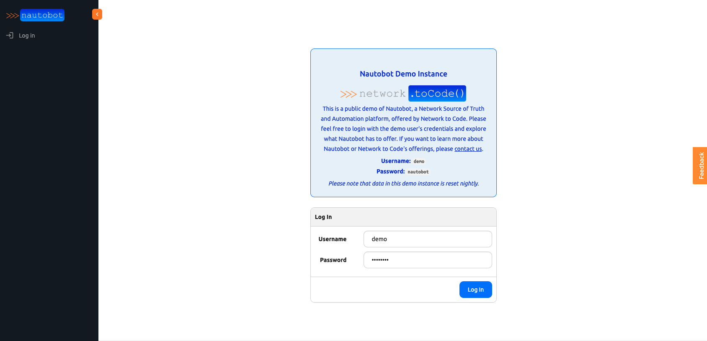
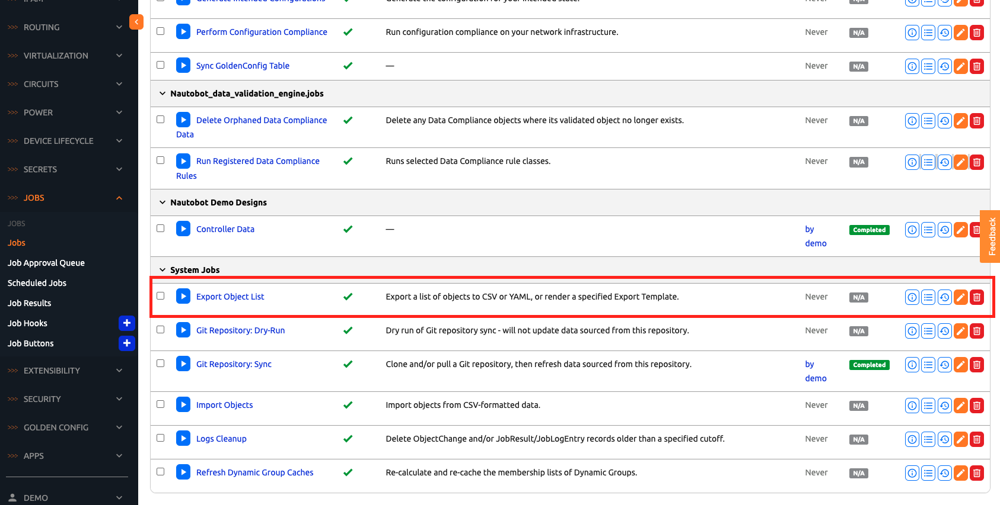
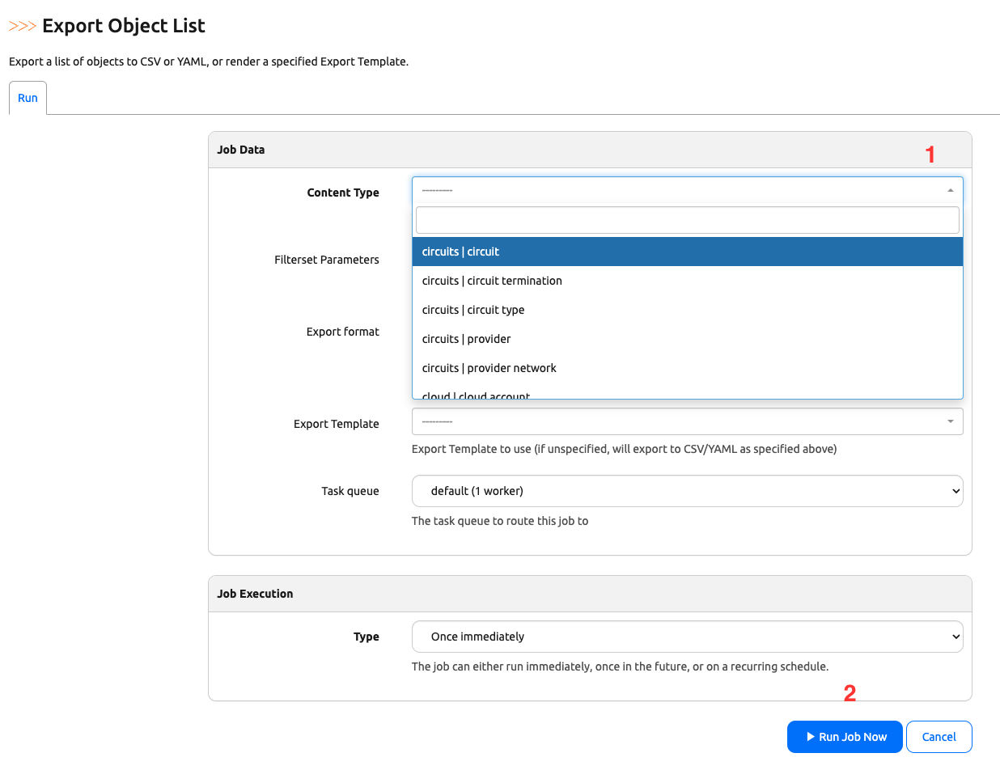
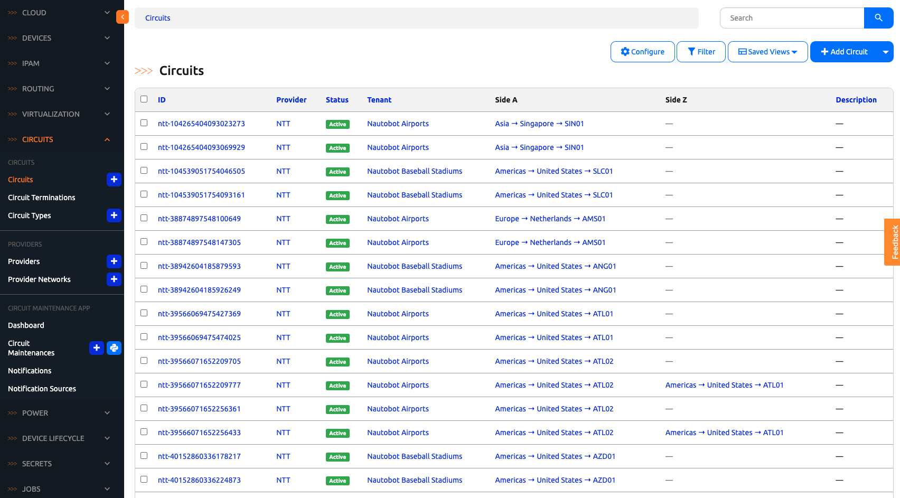

# Nautobot Jobs Overview

Nautobot is a network automation and orchestration platform that allows users to automate network tasks and workflows.

One of the key features that enables Nautobot to be an automation platform is the ability to run 'Jobs'. Each job is an executable script or program written in Python and stored within Nautobot.

> [!NOTE]
> If you're familiar with Netbox, Nautobot Jobs unify and supersede the functionality previously provided by Netbox "custom scripts" and "reports".

Jobs can extend Nautobot's functionality by creating custom automation scripts to perform tasks such as configuration management, data validation, report generation, and more.

For today's challenge, we will execute a predefined job on [demo.nautobot.com](https://demo.nautobot.com/) to familiarize ourselves with the basic usage of Jobs. We will also learn about the advantages of using Nautobot Jobs for your automation tasks.

> [!TIP]
> Open a separate browser window for [demo.nautobot.com](https://demo.nautobot.com/) to keep the instruction side-by-side (Right Click -> Open Link in New Tab)

## Nautobot Job Example

1. Navigate to [demo.nautobot.com](https://demo.nautobot.com/) and log in using the username ```demo``` and password ```nautobot```:



2. On the left panel, expand the JOBS section and click on ```Jobs```: 

As you can see, the demo site has various jobs pre-installed from different Nautobot applications along with system jobs.


3. Scroll down to `System Jobs` and click on the blue Run button next to `Export Object List`: 



>[!TIP] 
> By default, newly created jobs are not enabled, that is why some of these jobs are 'shadowed' out. But this 'Export Object List' job is enabled by default. 

4. Let's pick `circuits|circuit` from the `Content Type` dropdown menu, leave all the options as default, then click `Run Job Now`:



5. You will be redirected to the "Job Result: Export Object List" page where you can check on the status of the job as well as look at job execution logs. 

This job also produces a file output that you can click to download: 


After you download the file, you can see that it is a CSV representation of the existing circuit data. To verify, navigate to "CIRCUITS -> Circuits" on the left side of the screen:



## Advantages of Nautobot Jobs

You might be wondering, what is so special about executing this simple job? Let's point out a few things that worked behind the scenes to enable the job to run: 

1. **Asynchronous execution**

The job was executed in an asynchronous, non-blocking way. If you noticed, as soon as we click on `Run`, we were redirected to the results page. We did not have to wait for the job result to come back before we can interact with Nautobot again. 

This is due to the fact that Nautobot is integrated with the [Celery](https://docs.celeryq.dev/en/stable/getting-started/introduction.html) framework with distributed tasks queues. There is a message bus and a broker that allows for scalability, such as adding more workers to execute more jobs. 

By turning our scripts into Nautobot Jobs, we too can enjoy asynchronous execution using Celery distributed task queues.

2. **Accountability**

On the job result page, we can see the user who executed the job and the various log levels that were generated from its execution, providing both accountability and audit trails. 

3. **Performance benchmark**

We can see the basic performance benchmark in the job execution, such as the duration of the job from start to completion. 

4. **Interaction with existing Nautobot data**

This job interacted directly with the data existed in Nautobot. We did not have to write an external API call to Nautobot. The job has access to both the data and the relationship between the objects. 

5. **Other benefits**

There are lots of other benefits with Nautobot jobs that we will learn about as we move along, such as scheduling jobs, job hooks, permissions, and more. 

## Nautobot Job Documentation

In addition to executing the sample Job on [demo.nautobot.com](https://demo.nautobot.com), here are a few more tasks for today: 

1. Execute a few more jobs on the demo site, look over the different options and experiment with them. 
2. Read or at least glance over the `Nautobot Jobs` section in the [User Guide](https://docs.nautobot.com/projects/core/en/stable/user-guide/platform-functionality/jobs/). 
3. Familiarize yourself with the [Jobs Developer Guide](https://docs.nautobot.com/projects/core/en/stable/development/jobs/) and bookmark it, this will be a handy document to refer to for future days. 

## Day 2 To Do

Go ahead and post your newly completed Day 2 task with a screenshot of the Job Result page on a social media of your choice, make sure you use the tag `#100DaysOfNautobot` `#JobsToBeDone` and tag `@networktocode`, so we can share your progress, See you tomorrow! 

[X/Twitter](<https://twitter.com/intent/tweet?url=https://github.com/networktocode/100-days-of-nautobot-challenge&text=I+jst+completed+Day+2+of+the+100+days+of+nautobot+challenge+!&hashtags=100DaysOfNautobot,JobsToBeDone>)

[LinkedIn](https://www.linkedin.com/) (Copy & Paste: I just completed Day 2 of 100 Days of Nautobot, https://github.com/networktocode/100-days-of-nautobot-challenge, challenge! @networktocode #JobsToBeDone #100DaysOfNautobot)
